# Ask Hava — Master Fix Specification
**For:** Claude Code, working in the askhava.com repository
**Basis:** Acceptance audit of 2026-07-06 (`askhava-acceptance-audit-2026-07-06.md`). Every workstream below cites the audit IDs it closes (B=Blocker, M=Major, N=Minor, P=Polish, R=Root cause).
**Companion file:** `askhava-ui-mockups.html` — visual before/after renders referenced as **[Render §n]**.

---

## 0. Operating instructions for the agent

1. **Explore before editing.** The audit was black-box; file paths below are *search targets*, not known paths. Locate code with these verified grep anchors (all appear in production output):
   - Templates: `"Updated >6h ago"`, `"Cheapest today"`, `"volume-weighted"`, `"rotate daily"`, `"Happening today"`, `"Havasu headlines"`, `"No exact matches"`, `"Ad space"`, `"Claim this category"`, `"gseg"`, `"gsegwrap"`, `"gas-cheap"`, `"cpill"`, `"counts"`, `"feature-marquee"`
   - Assets: `lake_redesign.css`, `rotating_placeholder.js`, `static/biz-photos/`
   - Routes: `/events-ui`, `/home`, `/gas`, `/calendar`, `/movies`, `/map`, `/seniors`, `/night`, `/today`, `/sponsor`, `/portal/advertise`, `/portal/placements`, `/portal/reserve`, `/chat`, `/ask`, `/contribute`, `/feedback`, `/claim/<slug>`, `/provider/<slug>`, `/events/<uuid>`, `/events/<uuid>.ics`, `/img/poster`
   - Data smells: slugs `circle-k-gas-station-3`, `chevron-4`, `ballet-havasu-2`; literal strings `"Go Lake Havasu Visitor Center"`, `"Parker area"`, `"havasuchat.com"`
2. **Work order = §1 → §13.** One branch per workstream (`fix/ws1-cache`, …). Each workstream ends with its **Acceptance tests** green.
3. **Pipeline rules:** never hand-delete duplicate rows or hand-move miscategorized items — fix the pipeline, add a migration/backfill, then prove idempotency by re-running ingestion twice and diffing (row count delta must be 0 on the second run).
4. **Write tests first** for WS3/WS4/WS5 using the fixtures in §14 (they are real production defects; they become the regression suite).
5. **Verification is cold-cache:** all page-freshness checks must be run with no cookies and a bot-like UA (e.g. `curl -A "Googlebot"`), because the defect only reproduces cold (audit B1).
6. Timezone everywhere: **America/Phoenix** (Arizona, no DST). Never bare local datetimes.

### Current system (inferred from behavior — verify and correct this map first)

```mermaid
flowchart LR
  subgraph SRC[Sources currently ingested]
    GP[Google Places<br/>place_id + reviews]
    GLH[GoLakeHavasu directory<br/>no place_id match]
    PR[Parks & Rec feed]
    TIX[Veezi + internet-ticketing<br/>showtimes]
    RSS[News-Herald / RiverScene / City RSS]
    WX[NWS · USBR · EPA AirNow]
    GASD[Gas price source]
  end
  SRC --> ING[Ingest scripts<br/>exact-name matching<br/>keyword classifier]
  ING --> DB[(DB: flat providers<br/>flat one-day events)]
  DB --> TPL[SSR templates<br/>~6 header chromes<br/>per-template count queries]
  TPL --> PC[Full-page cache<br/>per-URL, no TTL discipline]
  PC --> CDN[Cloudflare]
  CDN -->|cold / bots: stale| U1[Users & crawlers]
  TPL -->|warm session: fresh| U1
```

---

## 1. WS1 — Cache & freshness overhaul  *(closes B1, B6, M4-partial, M20-partial · root cause R1)*

**Observed defect matrix (2026-07-06):**

| URL (cold) | Served content date | Age |
|---|---|---|
| `/events-ui` | Sun **Jun 28** (title + H1 + feed) | 8 d |
| `/events-ui?view=week` | week of **Jun 10–16** | 26 d |
| `/calendar` | **June 2026**, "today" = Jun 26 | 10 d |
| `/movies` | Sat **Jun 20** + June date chips | 16 d |
| `/map` | **Jun 10** | 26 d |
| `/gas` | data **Jun 10** ("Updated >6h ago") | 26 d |
| `/categories` | Jul 2 | 4 d |
| `/categories/things-to-do…`, `/colleges…` | Jun 27 + literal "stale" label beside "Live" chip | 9 d |
| `/categories/family-and-education` | Jun 21, gas $3.95 | 15 d |
| Same URLs, warm browser session | Jul 6 (fresh) | 0 |

Five gas prices visible concurrently: $3.59 / $3.69 / $3.75 / $3.95 / $4.19.

### Target architecture

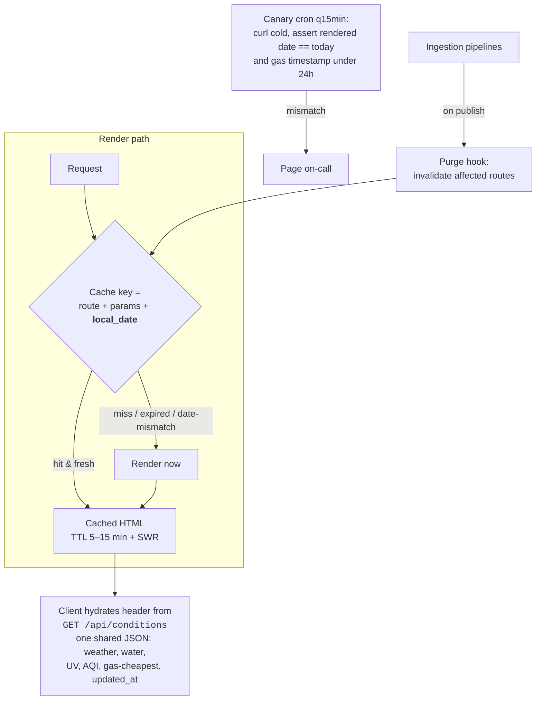

**Implementation requirements**
1. **Date-partitioned cache keys.** Any page whose content depends on "today" (`/home`, `/events-ui*`, `/calendar*`, `/movies*`, `/gas`, `/map`, category pages with open-now flags) includes `America/Phoenix` local date in the cache key. A June 28 render is *unservable* on June 29 by construction.
2. **TTLs:** HTML 10 min with `stale-while-revalidate=60`; `/api/conditions` 5 min; static assets keep hashes. Set `Cache-Control` correctly for Cloudflare (currently cold-vs-warm divergence implies cookie-keyed bypass — make cache behavior uniform for all visitors).
3. **Purge-on-publish:** every pipeline run ends with a purge call for its routes (gas run → `/gas`, `/api/conditions`; events run → `/home`, `/events-ui*`, `/calendar*`; movies run → `/movies*`).
4. **One conditions source:** delete the per-template baked-in header snapshots (this is what created $3.59–$4.19 simultaneously). Header/util bar renders skeleton server-side and hydrates from `/api/conditions`; no-JS fallback = last-rendered values with a visible timestamp.
5. **Honest staleness UI:** if `updated_at > 24 h`, show "not updated since <date>" in amber — never a "Live" chip beside a "stale" label. Grep anchor: the class/branch that emits `Cheapest gas · stale` together with `Live`.
6. **Canary:** cron every 15 min, cold-fetch the seven URLs in the table above, fail if rendered date ≠ today or gas `updated_at` > 24 h. Wire to alerting.
7. **Single "today" feed API** (also fixes B6): `/home` and `/events-ui` must consume the same `GET /api/feed?date=YYYY-MM-DD` — today the two disagree (Classes & Workshops present on `/home` Jul 6, absent on `/events-ui?date=2026-07-06`; same film attributed to different theaters). One query, two skins.

**Acceptance tests (WS1)**
- [ ] Cold `curl -A Googlebot` of all 10 URLs in the defect matrix: rendered date == today, exactly one distinct gas price across all fetches.
- [ ] `/events-ui` cold title is "**<today's weekday, month day>** — Ask Hava events…".
- [ ] Kill the gas pipeline for a simulated 30 h → `/gas` shows amber "not updated since…", canary alert fires, no "Live" chip.
- [ ] `/home` vs `/events-ui?date=<today>`: identical section list and item counts (snapshot-diff test).

---

## 2. WS2 — Dead routes, 404, route health  *(closes B2, part of B3)*

**Defects:** `/seniors` → empty body (primary-nav link, verified twice); `/portal/advertise` → empty body (the rate card, verified twice); unknown URLs (e.g. `/provider/anything-wrong`) → empty body, no 404 template.

1. Find why the two routes return empty (unregistered blueprint? template exception swallowed? middleware?). Fix root cause — likely one bug killing several routes; audit all routes in nav/footers: `/seniors`, `/today`, `/feedback`, `/contribute`, `/account/favorites`, `/help`, `/contact`, `/portal/reserve`.
2. **`/seniors` page** (snowbird town — this is a first-class audience): reuse the `/family` hub template but with *content, not chat deflection* (see WS8 rule): today's Seniors feed section (data already ingested — Senior Center Billiards/Hand & Foot/Party Bridge/Meals-on-Wheels appear in `/events-ui?date=2026-07-07`), 50+ P&R programs, senior-relevant categories. **[Render §6]**
3. **404/500 template:** brand header, "we couldn't find that", search box, top-6 category links, link to `/contribute` ("know a place we're missing?"). Correct status codes (404 not blank-200). **[Render §5]**
4. **Route-health monitor:** extend WS1 canary — every URL present in header/footer/nav components must return 200 with non-empty `<main>`. A nav link that blanks should page someone.

**Acceptance:** all nav-graph URLs 200 + non-empty; unknown URL → styled 404 with 404 status; `/seniors` renders today's senior events cold.

---

## 3. WS3 — Advertiser funnel & rate card  *(closes B3, M20-partial, P3, P6)*

**Current funnel (observed):**

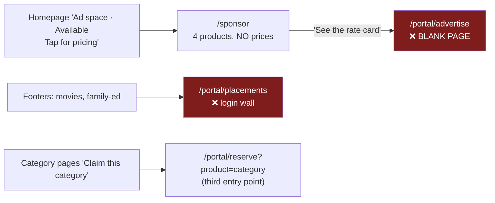

**Target funnel:**

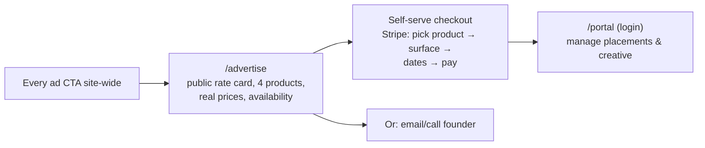

1. Single canonical **`/advertise`**; 301 `/sponsor`, `/portal/advertise`, `/portal/placements` → it. Update every footer/CTA target (grep: `portal/advertise`, `portal/placements`, `/sponsor`).
2. Publish the rate card. Products already defined on `/sponsor` — price them (audit benchmark for this market: featured/category ownership $50–300/mo tiers, supporters wall $15–50/mo). Show per-surface availability ("Restaurants — taken until Aug 1"). **[Render §7]**
3. **Terminology split (B3):** "Claim" = free listing ownership only. Paid category placement renamed **"Sponsor this category."** Grep anchor: `Claim this category`, `Claim this spot`.
4. Empty inventory: replace "Your logo here / Ad space · Available" consumer-facing placeholders with house promos (newsletter signup, claim-your-listing) + a small "Advertise here" text link (P3).
5. Keep the honesty framing ("one labeled unit per surface, no dark patterns") — it is the sales pitch; put it on `/advertise` with the prices.

**Acceptance:** from homepage ad slot to a Stripe test-mode payment in ≤ 3 clicks; zero links to the three legacy URLs; a business owner can see every price without an account.

---

## 4. WS4 — Provider entity resolution & dedup  *(closes B4, M4-partial, M5, N7-partial · root cause R2)*

**Evidence recap:** ≥15 duplicate pairs in Restaurants alone (fixture list §14.1); dupes pair a Google-Places-matched record (reviews) with a review-less twin from the **GoLakeHavasu directory import** (proof: twins addressed "Go Lake Havasu Visitor Center"; Stetson Winery/Black Meadow Landing exist in GLH's directory). Slug suffixes (`-2`, `-3`) prove collisions detected-then-shipped. GLH import also brought out-of-region (Stetson = Kingman, labeled "Parker area ~155 min") and closed businesses (Stetson: closed per Yelp 2025).

### Target data model

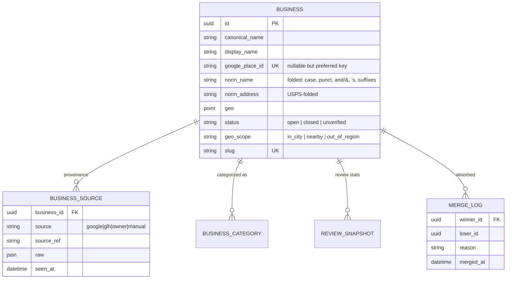

### Matching pipeline (run on every ingest AND as a one-time backfill)

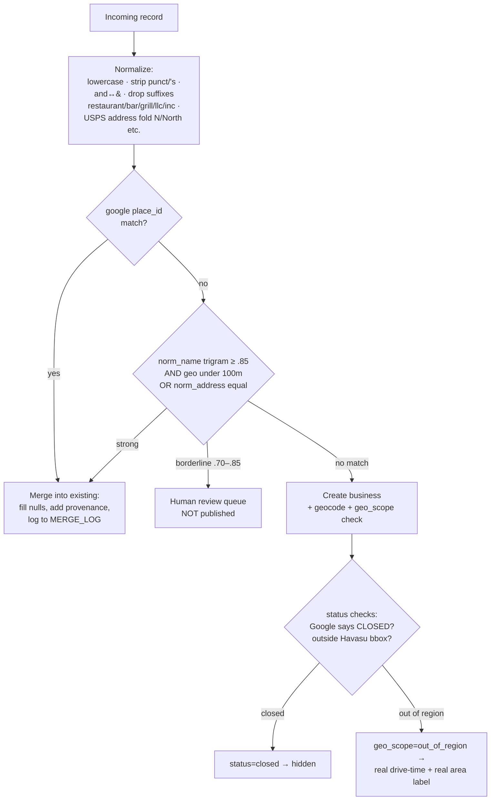

**Implementation requirements**
1. Normalization functions with unit tests from fixtures §14.1 — each of the 15 pairs must match under `norm_name`+`norm_address` rules (that's the point of using real defects as fixtures).
2. Backfill migration: run matcher over existing table; auto-merge ≥.85+address; queue the rest. **Redirect merged slugs 301 → winner** (external links/SEO). Expected result: the 15 restaurant pairs, bars twins (The Office ×3, McKee's ×2, Kokomo ×2, Hangar 24 ×2, Ghost Mine ×2), and gas-station suffix clones collapse.
3. Idempotency proof: re-run the GLH import twice on a staging copy → second run creates 0 businesses.
4. **Geo-scope fix (M5):** replace the hardcoded `"Parker area"` annotation (grep it) with computed drive-time (OSRM/Google, cached) + nearest-town label from geo. Stetson: "Kingman · ~1 h 15 m" — or better, drop it: `status=closed` hides it entirely.
5. **Address integrity:** reject/queue imports whose address field matches a known landmark ("Go Lake Havasu Visitor Center") or is bare digits (`^\d+$` — "Rusty's Restaurant, 2806").
6. "New / few reviews yet" chains (McDonald's, Subway ×3, Dairy Queen, Denny's twin): after place_id matching these inherit review stats or merge away — assert none of the §14.1 names show "New / few reviews" after backfill.
7. Recompute the "2,400+ real local listings" claim from post-merge count (M20).
8. **Display-name normalization (P5):** store `display_name` separately from source name; title-case ALL-CAPS imports ("LACARCACHA" → "LaCarcacha", "DELI LAUNDROMAT" → "Deli Laundromat") with a protected-brands exception list (BJ's, IHOP, ARCO, BRB).

**Acceptance:** `/categories/eat-and-drink/restaurants` contains exactly one of each §14.1 pair; Ghost Mine Saloon appears once site-wide; Stetson hidden or correctly labeled; re-scrape produces zero new duplicates; slug 301s live.

---

## 5. WS5 — Event series/instance model + ICS  *(closes B5, N-series issues · root cause R3)*

**Evidence:** "Afternoon Enrichment Workshops" + "Afternoon Enrichment: <theme> Lab" both 12:30 PM @ Desert Bloom, every day (series record + daily session ingested as siblings). "Pickleball Open Play" mints a new UUID per day. ICS for a nightly Jul 6–10 camp exports as one 96-hour block, no TZID.

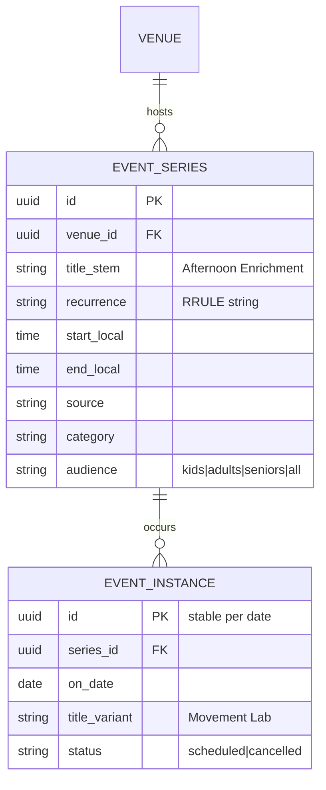

**Requirements**
1. **Dedup rule (ingest-time):** same venue + start-time overlap ±15 min + title prefix/cosine similarity ≥ .6 ⇒ same series; the more specific title becomes `title_variant`, the generic one the `title_stem`. Fixture: §14.2.
2. Recurring UUIDs: instance IDs deterministic (`hash(series_id + date)`) so a day's URL is stable across rescrapes.
3. **ICS fix** — current vs required output for `74457a55-…` (Rainforest Rush, nightly 6–8 PM Jul 6–10):

```ics
BEGIN:VEVENT
UID:74457a55-161d-4798-97dd-32010bacadff@askhava.com
DTSTART;TZID=America/Phoenix:20260706T180000
DTEND;TZID=America/Phoenix:20260706T200000
RRULE:FREQ=DAILY;UNTIL=20260711T065959Z
SUMMARY:Rainforest Rush Kids Camp 2026
LOCATION:3516 McCulloch Blvd N\, Lake Havasu City\, AZ 86406
URL:https://abundantgracelhc.churchcenter.com/registrations/events/3574030
END:VEVENT
```
   (Bug being fixed: audit found `DTSTART …0706T180000 / DTEND …0710T180000`, no RRULE, no TZID — a single 4-day block.) Include `VTIMEZONE` for America/Phoenix or rely on TZID per RFC 5545 with the definition embedded.
4. Event **detail pages** for series render "Nightly, Jul 6–10 · 6–8 PM" instead of collapsing to one date.
5. Feed rendering: an instance shows once; the series never shows alongside its own instance (kills the Afternoon Enrichment double).
6. **Internal links everywhere (M7):** every feed/calendar item links to its internal `/events/<instance>` page (savable, ICS, reportable, tracked); the external source URL (Desert Bloom site, gymnastics booking page, Facebook) renders as the "Register / More info" button on that detail page. Today some items deep-link externally and the same item flips internal↔external between renders — after this change, external hrefs in feed lists are a lint error.

**Acceptance:** Jul-equivalent day feeds show exactly one Afternoon Enrichment row (variant title); ICS validates in `icalendar` lib + imports into Google Calendar as 5 evening events; pickleball URL identical across two scrapes.

---

## 6. WS6 — Classification & data linting  *(closes M1, M2, M3, part of M5 · root cause R4)*

**Evidence:** P&R kids events under "Things To Do → Around Town" (Popsicles in the Park; Big Fish Little Fish); senior program (Mexican Train Dominoes) outside the Seniors section; "Charles-Italy Massage Therapy" under **Colleges & Higher Ed**; Mohave Traffic School under Colleges; Mohave College tagged "Kids Lessons"; cigar shop in Bars & Breweries; "Western States Restaurant **Consulting**" in Restaurants; venue open-hours injected as events ("Golf Course — Open daily", billiards halls, Altitude's hours) padding counts and flooding the calendar; "Glow in the Dark Painting" at 5:30 **AM**.

### Classification precedence

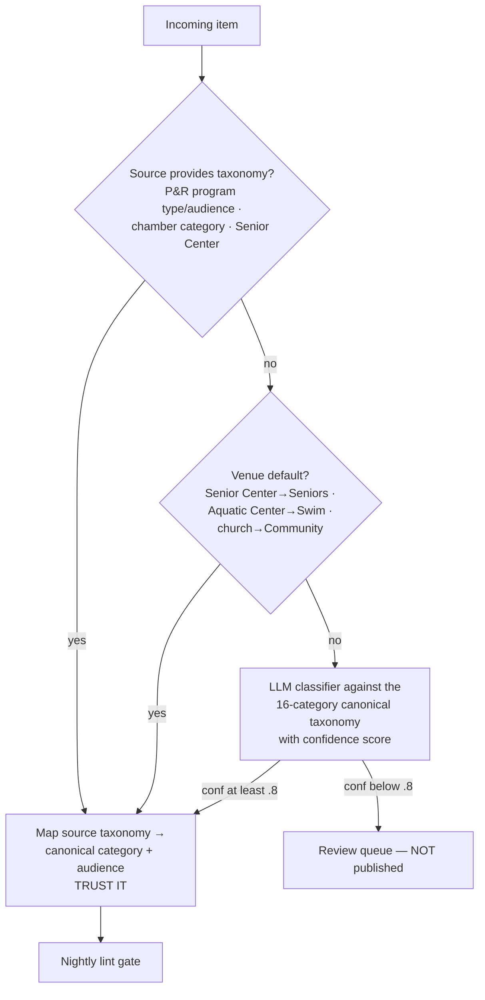

**Requirements**
1. Build the source-taxonomy maps first (P&R and Senior Center feeds already carry audience/program metadata that is currently discarded — find where ingest drops it).
2. **Venues ≠ events (M2):** items with no dated occurrence (open-hours entries: billiards, bowling, trampoline hours, golf courses/simulators/driving ranges) move to a `places_open_today` rail, rendered under a separate "**Open today**" header, excluded from event counts and calendar cells. The CSS already anticipates this (`.cpill.places` "Places & Ongoing tab" comment). **[Render §3b]** Calendar month cells then render per-day category counts (colored dots + number), not truncated title spam ending in "+72 more" (N9).
3. **Nightly lint (blocks publish, writes to review queue):**
   - event 12 AM–7 AM at a non-24h venue → probable AM/PM flip (fixture: Glow in the Dark Painting 5:30 AM; Family Night Golf 11 AM vs 5 PM across renders)
   - category ↔ tag contradiction (item tagged Beauty inside Colleges)
   - name contains `consulting|supply|wholesale|school` landing in consumer food/drink categories
   - geo outside Havasu bbox with `geo_scope=in_city`
   - address equals a landmark string or bare number (WS4.5)
   - section header count ≠ rendered item count (M4 fixture: "Martial arts 13" over 14 items)
4. Audience field drives placement: `audience=seniors` → Seniors section; `audience=kids` → Youth/Family; a P&R toddler event can no longer land in "Around Town".

**Acceptance:** §14.3 fixtures all classify correctly from a fresh scrape; calendar June-style cells contain zero "Toptracer Range/Golf Course/Billiards" pseudo-events; lint report is empty on two consecutive nightly runs.

---

## 7. WS7 — Template & component consolidation  *(closes B6-partial, M10, M12, M13, M14, N10 · root cause R5)*

**Evidence:** ≥6 header chromes, ≥4 footers; raw paths as visible link labels (`/chat` in headers, `/account` on `/categories`, `/events-ui?date=2026-07-05` as day-pager labels); two list-page templates (old: unfiltered inline list on Restaurants; new: filter chips + cards on Colleges); four taxonomy vocabularies (mega-menu vs homepage tiles vs `/categories` vs `/map` scopes); three support emails across two domains; counts differ per surface.

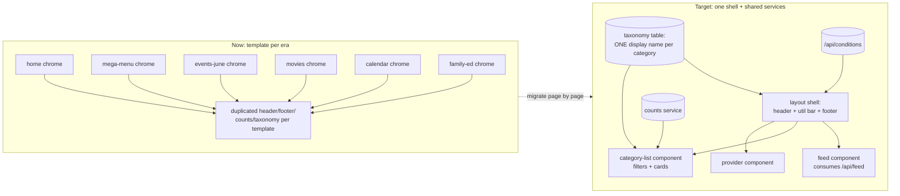

**Requirements**
1. **One layout shell** (header, util/conditions bar, footer). Migrate page-by-page; delete each orphaned template after its route flips. Expect meaningful LOC reduction.
2. **Raw-label bug (M14):** find the template variables rendering `[/chat]`, `[/account]`, and the day-pager `[/events-ui?date=…]` labels — likely `{{ item.label or item.href }}` fallbacks or missing icon renders. Prev/next pager gets `‹ Sun Jul 5` / `Tue Jul 7 ›` labels + `aria-label`.
3. **Canonical taxonomy (M10)** — single source table; every surface renders `display_name` from it:

| slug | display_name (everywhere) |
|---|---|
| eat-and-drink | Eat & Drink |
| on-the-water | Lake & Boating |
| things-to-do-and-attractions | Things to Do |
| outdoors-and-recreation | Outdoors & Recreation |
| fitness-and-wellness | Fitness & Classes |
| family-and-education | Kids & Families |
| home-and-property-services | Home Services |
| auto-rv-and-marine | Auto, RV & Marine |
| professional-and-financial | Professional & Financial |
| beauty-and-personal-care | Salons & Spas |
| pets | Pets & Vets |
| health-and-medical | Health & Medical |
| shopping-and-retail | Shopping & Retail |
| community-and-civic | Community & Civic |
| lodging | Places to Stay |
| worship-and-nonprofits | Worship & Nonprofits |
| city-and-government | City & Government |
| tattoo | Tattoo & Piercing |

   (Resolve the 16-vs-18 discrepancy: `/categories` shows 16 tiles but nav lists others — inventory actual category rows first, then align "All 16 categories" copy.) `/map` scopes become grouped *views over* these categories, labeled with the same names.
4. **Counts service (M4):** one materialized `category_counts` (recomputed on publish, post-WS4-merge). Homepage tiles, `/categories`, category headers, subcategory chips, section headers all read it. Fixtures §14.4 become assertions.
5. **Gas-widget de-duplication (M12):** the 5-station "Cheapest gas near you" expander appears on home/events/news/calendar/provider pages; collapse to the single header chip (`$3.59 Cheapest gas`) that opens `/gas`. On `/gas` itself, delete the "Cheapest today" card block (rows 1–6 of the adjacent table). The homepage keeps ONE events feed owner: `/home` shows a *summary* (top 3 per section + counts) linking into `/events`; the full feed lives on `/events` only. **[Render §2]**
6. **One footer:** one support email on the askhava.com domain; `/feedback` link everywhere (kill `mailto:hello@havasuchat.com`, `sponsors@havasuchat.com` — grep `havasuchat`); one © line; advertise → `/advertise`; lake → `/lake` (301 `/today` → `/lake`).

**Acceptance:** DOM-diff of header/footer across 10 routes is identical; zero occurrences of `havasuchat` in codebase; Eat & Drink count identical on homepage tile, `/categories`, and its own page; no raw path visible as link text anywhere (regex sweep of rendered HTML: `>(/[a-z-]+(\?[^<]*)?)<` on link labels).

---

## 8. WS8 — Mobile & responsive fixes  *(closes M15, M16, M17, P4)*

**Measured facts:** `.gseg.lg` renders at a fixed **353 px**; wrapper `.gsegwrap{margin:14px 0 2px}` — `overflow-x: visible`, no wrap; **no media query touches `.gseg` at any width** (stylesheet's narrowest breakpoint is 430 px). With 16 px page gutters it needs ~385 px ⇒ "Diesel" clips at 375 px (standard iPhone), not just 320 px. Same-class rows: `.counts{display:flex;gap:8px;padding:13px 16px 8px}` with `white-space:nowrap` `.cpill`s — no wrap, no scroll. Tap targets: `.gseg` buttons compute ~21–29 px tall; calendar `.chip` text 10 px.

**CSS deltas (lake_redesign.css — apply the same pattern in any sibling sheets found for other chromes):**

```css
/* M15 — grade selector: wrap to 2×2 below 430px, keep 44px targets.  [Render §1] */
.gseg{display:flex;flex-wrap:wrap}
.gseg button{min-height:44px;padding:10px 16px}
@media(max-width:430px){
  .gseg{width:100%}
  .gseg button{flex:1 1 45%}          /* 2×2 grid; Diesel always visible */
}

/* M16 — pill/chip rows: scrollable with snap, never clipped */
.counts{flex-wrap:nowrap;overflow-x:auto;-webkit-overflow-scrolling:touch;
        scroll-snap-type:x proximity;scrollbar-width:none}
.counts::-webkit-scrollbar{display:none}
.cpill{scroll-snap-align:start;min-height:44px}

/* M17 — tap targets on time pills (movies/showtimes) */
.tpill{min-height:44px;display:inline-flex;align-items:center;padding:8px 12px}

/* P4 — decorative glow overflow */
.glow{max-width:100vw;overflow:hidden}   /* or contain within a masked parent */
```

**Also required**
1. Sweep every horizontal flex row for the missing-wrap class: date chips (`Today 6 … Sun 12`), movie-time pill rows, filter chip bar, bottom tab bar (6 items at 320 px — verify ≥44 px targets; drop to 5 by merging Map into Explore if cramped).
2. Add 375 px and 320 px to the visual-regression matrix (Playwright: `/home`, `/gas`, `/events`, restaurants, provider, calendar at 320/375/430/768/1280). Assert `document.documentElement.scrollWidth <= innerWidth` and that `.gseg` last button's right edge ≤ viewport.
3. Overnight-hours rendering (part of M19, do here in the hours formatter): periods crossing midnight render "10:30 AM – 1 AM", never "12 AM – 1 AM, 10:30 AM – Midnight". Fixture: In-N-Out (§14.5).

**Acceptance:** Playwright matrix green; at 320 px the gas page shows all four grade labels fully; no horizontal document scroll on any matrix page; all interactive controls ≥ 44 px.

---

## 9. WS9 — Discovery: facets, search, quick filters  *(closes M8, M9, N8 · benchmark: Yelp facets, Do512 curation)*

### 9a. Restaurants (and all big categories) — faceted list  **[Render §3]**
1. Kill the old unfiltered inline-list template; standardize on the filtered card template (the one Colleges already uses) for **every** subcategory.
2. Facet bar for Eat & Drink: **Cuisine** (Mexican, Italian, American, Sushi/Japanese, Chinese/Thai, BBQ, Pizza, Burgers, Seafood, Coffee/Café, Fast food), **Open now**, **Price**, **Waterfront/patio**, **Kid-friendly**. Provider pages already carry attribute tags ("American", "Breakfast", "Outdoor Seating", "Group-Friendly") — the data exists; where cuisine is missing, backfill from Google Places `types` + a one-shot LLM pass over names/descriptions into a fixed cuisine enum (audit trail via WS6 review queue).
3. Facets = query params (`?cuisine=mexican&open=1`), server-rendered (SEO pages: "Mexican restaurants in Lake Havasu City"), crawlable links, `<link rel=canonical>` on filter combos beyond depth 1 → parent.
4. **Ranking honesty (M8):** default sort = the *actual* volume-weighted score (e.g. Bayesian: `(v/(v+m))·R + (m/(v+m))·C`, m≈25, C=city mean). If daily rotation stays for equity, label the default "Featured (rotates daily)" and make "Top rated" the honest sort one tap away. The printed methodology and the observed order must match — currently ★5.0(5) sits above ★5.0(163) under a "volume-weighted" caption.
5. Apply the same facet principle per category: Home Services → trade (plumber/electrician/HVAC) + emergency/24h; Lodging → hotel/RV/vacation-rental + pet-friendly; On the Water → rentals/ramps/fuel/repair (this also fixes the `/lake` tiles, WS10).

### 9b. Search = structured results first, chat as escalation  *(M9)*

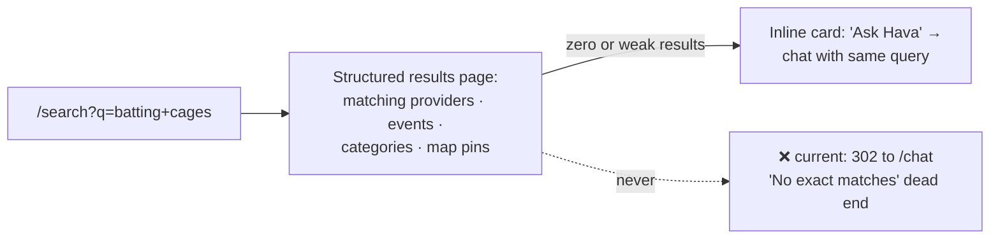

1. Implement `/search` as a real SERP (SQLite FTS/Postgres tsvector over name, category, tags, description + event titles). Keep `/chat` for conversational queries; the SERP embeds an "Ask Hava about this" escalation card.
2. Synonym layer seeded with local head terms: batting cages→Split Finger/SARA cages (after WS12 adds them), splash pad, happy hour, oil change, boat rental, urgent care.
3. Zero-result queries get logged to a dashboard — they are the coverage backlog (this is how "batting cages" should have been caught).

### 9c. Feed quick filters  *(N8)*
Add to `/events` day/week views alongside the existing 🧒 For kids: **Free**, **Indoor** (110°F town — derive from venue attribute), **Tonight** (≥5 PM), **This weekend** (Fri–Sun view, the default landing tab Fri–Sun). Params: `?free=1&indoor=1`, server-rendered.

**Acceptance:** `/categories/eat-and-drink/restaurants?cuisine=mexican` returns only Mexican, server-rendered, in <ranking that matches its label>; `/search?q=pizza` renders ≥5 providers with no redirect; `/search?q=batting+cages` post-WS12 returns Split Finger; weekend default view live Fri–Sun.

---

## 10. WS10 — Hub pages with real content  *(closes M11 · relates to N8)*

Rule: **a hub tile may only link to a chat query if no structured surface exists — and then it's a backlog item, not a design.** Current state: `/lake`, `/family`, `/night` are 6-tile pages where 4–5 tiles open canned `/chat?q=…`; `/night`'s "Bars & Lounges" and "Breweries & Wineries" both point at the generic Eat & Drink parent.

| Hub | Replace chat-tiles with | Data source |
|---|---|---|
| `/lake` | Ramp list w/ fees+status; water temp/level module; wind/UV strip; boat-rental subcategory list; marina fuel list | USBR + NWS already cited in header; On-the-Water subcats exist |
| `/family` | Today's kids feed (audience=kids from WS6); **Camps hub** (see below); splash pads/parks list; indoor list (Indoor attribute) | events DB + attributes |
| `/night` | Live-music list (WS12 FB connector); happy-hour table (venue, days, times); late-kitchens list (closes ≥10 PM from hours data); bars **subcategory** links | hours data exists today; FB connector fills music/HH |
| `/seniors` (WS2) | Today's seniors feed; Senior Center weekly grid; 50+ P&R programs | already ingested |

**Camps hub** (`/family/camps`): seasonal index of day camps (Altitude ALOHA, Split Finger clinics, Dynamix, Black Belt Academy, P&R Camp I Wanna Go, church VBS) with age range, dates, price, registration link — filter by week-of-summer + age. RiverScene publishes this annually as an article; Ask Hava should own it as a living page. Sources arrive via WS12.

**Acceptance:** zero `href^="/chat?q="` on the four hubs; `/night` bar tiles land on bars-and-breweries subcategory; `/lake` shows live water temp + at least 3 ramps with fee info.

---

## 11. WS11 — Provider page upgrades  *(closes M19, N5-related, N7)*

Verified gaps (Siddhartha's Garden, In-N-Out, Altitude): no website button (the URL exists — it's embedded in each page's own "Suggest an edit" link, grep `contribute?kind=provider&…url=`), no photo gallery, no upcoming-events module (Altitude's own "Junior Jump Time" event doesn't show on Altitude's page), mangled overnight hours, related-items module is category-random (plant-based café → In-N-Out).

**Target layout [Render §4]:** header (name, rating, category chips, open-now) → action row (**Call · Directions · Website · Save**) → photos (owner-supplied post-claim; hero until then) → **Upcoming here** (next 5 `event_instance` at this venue — this is the advertiser hook) → About + attribute chips → Reviews (3 + "read all") → Hours (WS8 formatter) → Map/Find it → claim CTA → related ("More <subcategory>" by same-category + distance, not random).

Also: `LocalBusiness` JSON-LD on every provider page (see WS13), and event pages get `Event` JSON-LD.

**Acceptance:** Altitude's page lists Junior Jump Time with a working link; every provider with a stored URL shows a Website button; In-N-Out hours render "10:30 AM – 1 AM"; related items share the subcategory.

---

## 12. WS12 — Coverage connectors  *(closes M6 · root cause R6 — the moat)*

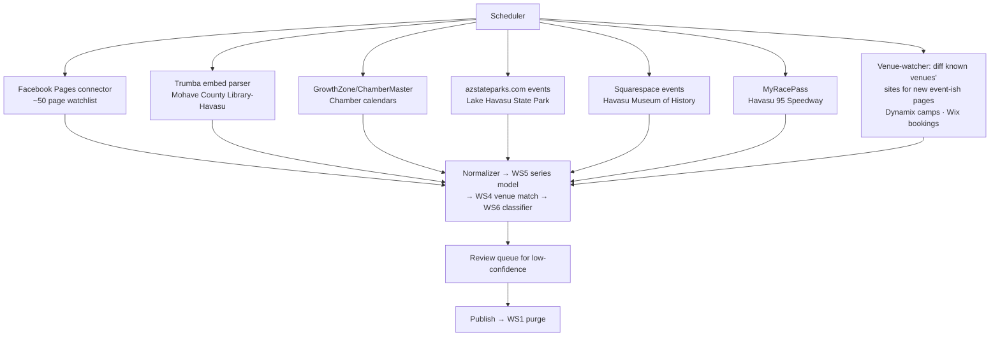

**Priority order & first watchlist**
1. **Facebook Pages** (highest yield; closes the client's two named gaps at once): `altitudelakehavasu` (ALOHA camps, Glow nights), Split Finger Athletics' page, `BarleyBrothers` (happy hour M–F 3–6 + live music), `CollegeStreet`, Flying X Saloon, Kokomo, Lady Lee's, churches (Calvary Baptist, Calvary Chapel LHC), Lake Havasu Baseball Academy (SARA Park cages), Grace Arts Live, Havasu 95 Speedway. Post → event extraction (date/time/title/price) via LLM with WS6 confidence gating.
2. **Split Finger Athletics — directory entry now** (independent of connector): 5601 Hwy 95 Bldg F Ste 600, (928) 223-1504, splitfingerathletics.com, category Fitness/Batting Cages + Kids' Classes & Camps. Currently absent entirely; `/search?q=batting cages` must stop returning nothing.
3. Trumba (library storytimes — pure JSON underneath the embed), azstateparks (Bluegrass, Boat Show, campouts), GrowthZone chamber calendar, museum Squarespace, MyRacePass.
4. **Venue-watcher:** for venues with `website` but no feed, hash their pages weekly; on diff, run extraction; notable: Dynamix `/summer-camp-2026` sub-page pattern, Wix booking pages.
5. Every connector records provenance (WS4 `business_source` pattern) and goes through the same normalize→match→classify gates. No connector writes to prod directly.

**Acceptance:** Altitude camps and ≥1 Split Finger camp/clinic visible in the kids feed within one scheduler cycle; happy-hour table has ≥10 venues; zero-result log (WS9) no longer contains "batting cages"; each connector re-run is idempotent.

---

## 13. WS13 — SEO, schema, routes, news  *(closes M18, N1, N2, N4, N6, N11, P1, P2)*

1. **Routes:** 301 `/events-ui` → `/events` (update nav, sitemaps, canonicals; keep param passthrough `?date=`, `?view=`); 301 `/today` → `/lake`; keep `/ask` → `/chat`. Root `/` should 200 with the homepage rather than redirect to `/home` (or at minimum 301, one hop, with canonical = `/`).
2. **Slugs (N1):** transliterate Unicode in slugifier (`café → cafe`); migrate `caf-s-and-coffee` → `cafes-and-coffee` with 301.
3. **JSON-LD:** `LocalBusiness` (name, address, geo, phone, openingHoursSpecification, aggregateRating from Google-sourced stats with `ratingCount`) on provider pages; `Event` (name, startDate/endDate with timezone, eventSchedule for series, location, offers.url) on event pages; `FAQPage` for the category FAQ blocks (also fix the visible `###` markdown artifact — P2); `BreadcrumbList` site-wide. Gas page: add `Dataset`-style freshness meta or at minimum ensure the "updated" timestamp is machine-readable.
4. **Titles/H1 (N4, P1):** homepage H1 gains the head phrase ("Lake Havasu City's local directory — what's open, what's on"); drop "Best" from auto-generated category titles until curation exists, or gate it on `count ≥ N ∧ post-dedup`.
5. **Sitemap (N11):** regenerate on publish; must include provider + event URLs with real `lastmod`; verify it's not serving a stale snapshot (same WS1 canary can assert `lastmod` freshness).
6. **News page (M18):** section into tabs — **Local** (News-Herald local + RiverScene + City alerts, default), **City Hall** (CivicAlerts), **Opinion**, **Wire/Beyond Havasu** — using source + URL path heuristics (`/news/nation/`, `/opinion/`, `/lifestyle/` map cleanly). De-dup the "Daily Planner" series to latest. Label paywalled News-Herald links ("subscription"). Homepage "Local news" module pulls Local tab only. **[Render §8]**
7. **Movies fixes (N5):** group showtimes by film entity across both theaters (one card per film, theater rows beneath — Fandango pattern) instead of duplicate independent cards with conflicting runtimes (2h2m vs 2h3m for the same film); every showtime chip links to *ticketing*, never a `/deals` promo page (audit: Dora, Jul 7); serve posters through the proxy with width params + srcset.
8. Cache headers for bots = humans (ties WS1): the June-content-on-canonical-URL problem is the single biggest SEO defect; after WS1, request indexing re-crawl via Search Console.

**Acceptance:** Rich-results test passes for a provider, an event, a category FAQ; `/events` serves with today's date cold; news default tab contains zero `news/nation` or `lifestyle` syndication items; no "Pringles Pop Dog Buns" under a "Havasu headlines" H1 ever again.

---

## 13b. WS14 (optional, post-gate) — growth adds from audit §4

Not blockers; do after the master gate: (1) **daily "Today in Havasu" newsletter** — the homepage already composes it; add subscribe form + send pipeline + one sponsor slot (ties WS3); (2) **public `/status` page** — last successful run per pipeline (gas, events, movies, news, conditions), turning WS1's canary into a trust feature; (3) **visitor landing** ("3 days in Havasu") for the ~1M tourists/yr; (4) happy-hour dataset product once the WS12 Facebook connector supplies data (table: venue, days, times, deal — surfaces on `/night` and as a category sponsor unit).

---

## 14. Regression fixtures (from production, 2026-07-06)

### 14.1 Provider duplicate pairs (WS4 unit tests — each pair must merge)
| Keep (has reviews) | Merge away (GLH twin) | Shared key |
|---|---|---|
| Denny's Restaurant ★4.1(1847) | Denny's | 1620 McCulloch Blvd N |
| Dos Amigos Tacos ★4.4(124) | Dos Amigos Taco's | 2231 McCulloch #107 |
| Sloane's Craft Kitchen + Cocktails ★4.5(62) | Sloane's | 2198 McCulloch |
| Shugrue's Restaurant and Brewery Group ★4.4(1732) | Shugrue's Restaurant & Bar; Shugrue's Bridgeview Room | 1425 McCulloch (+landmark addr) |
| Niko's Grill & Pub ★4.5(757) | Niko's Grill and Pub | 2690 N Kiowa |
| Hangar 24 Lake Havasu ★4.5(603) | Hangar 24 Taproom & Restaurant | 5600 AZ-95 #6 |
| Rosati's Pizza ★4.3(1867) | Rosati's Pizza & Pasta | 91 London Bridge Rd |
| Filiberto's ★3.7(671) | Filiberto's Mexican Food | 35 (N) Lake Havasu Ave |
| Montana's ★4.3(831) | Montana Steak House | 3301 Maricopa |
| Turtle Grille ★3.9(479) | Turtle Grille at The Nautical… | 1000 McCulloch |
| The Spot ★4.5(712) | The Spot - Pizza, Arcade & More | 3612 Jamaica Blvd S |
| Broken Yolk Cafe ★4.7(35) | The Broken Yolk | 440 El Camino Way |
| Bad Miguel's Mexican Restaurant ★4.3(1042) | Bad Miguel's | 1841 (N) Kiowa #103 |
| Rusty's Restaurant ★4.6(1796) | Rusty's | (addr variants) |
| Lin's Little China ★4.0(800) | Lina Little China | (typo variant) |
| Kokomo Beach Club ★4.4(563) | Kokomo - Beach, Surf & Party Bar | 1477 Queens Bay |
| The Office Cocktail Lounge & Grill ★4.6(525) | The Office; The Office Cocktail Lounge | 2180 (W) Acoma |
| McKee's Pub & Grill ★4.4(716) | McKee's | (verify addr — may be a move) |
| Ghost Mine Saloon | Ghost Mine Saloon (2nd render, same carousel) | UI-level double |

### 14.2 Event series dedup (WS5)
- "Afternoon Enrichment Workshops" + "Afternoon Enrichment: Movement Lab" — 12:30 PM, Desert Bloom, 2026-07-06 → one instance, variant="Movement Lab"
- Same + "…: Life Skills Lab" — 2026-07-07
- "Pickleball Open Play" @ Mike Delaney Complex — UUIDs `ef3b3a17…` (Jul 6) vs `5f116c56…` (Jul 7) → one series, stable per-date IDs
- Rainforest Rush ICS → RRULE nightly Jul 6–10, TZID America/Phoenix

### 14.3 Classification (WS6)
- Popsicles in the Park (P&R, 9 AM, Rotary Park) → Kids/Family, not Things-to-Do→Around-Town
- Big Fish Little Fish (Aquatic Center) → Kids/Swim
- Mexican Train Dominoes (P&R 50+) → Seniors
- Charles-Italy Massage Therapy → Beauty, never Colleges & Higher Ed
- Mohave Traffic School → not Colleges; Western States Restaurant Consulting → Professional, never Restaurants
- Lake Havasu Cigars → Shopping/Specialty, not Bars & Breweries
- Glow in the Dark Painting 5:30 AM → lint flag (AM/PM)
- "Golf Course — Bridgewater Links · Open daily" → places-open-today rail, never an event row

### 14.4 Count assertions (WS7)
Single source of truth; these observed contradictions become equality assertions: Eat & Drink 247/254/274 → one number everywhere; Lodging 56 vs 103; Things to Do 110 vs 122; Parks & Playgrounds 47 vs 60; For Kids & Families 48 vs 49; "Martial arts 13" header vs 14 rendered.

### 14.5 Formatting
- In-N-Out hours: periods `Mon 10:30–24:00 + 00:00–01:00` render as "10:30 AM – 1 AM" (never "12 AM – 1 AM, 10:30 AM – Midnight")
- Slug: `Cafés & Coffee Shops` → `cafes-and-coffee`
- Stetson Winery: `geo_scope=out_of_region`, town label "Kingman", `status=closed` → hidden

---

## 15. Sequencing & master acceptance gate

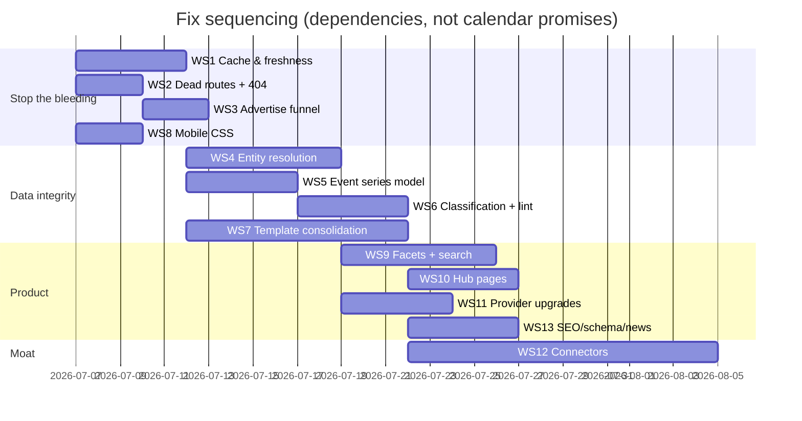

**Master gate (mirrors the audit's payment gate):**
- [ ] WS1 canary green for 48 consecutive hours (cold-cache, all routes, one gas price)
- [ ] WS2 route health: every nav URL 200 + non-empty; styled 404
- [ ] WS3: rate card public; test purchase completes
- [ ] WS4: §14.1 table fully merged; double re-scrape delta = 0
- [ ] WS5: §14.2 green incl. Google-Calendar ICS import
- [ ] WS6: §14.3 green from a *fresh scrape*; nightly lint empty ×2
- [ ] WS7: count assertions §14.4 green; one chrome; zero `havasuchat`
- [ ] WS8: Playwright 320/375 matrix green
- [ ] WS9: batting-cages query returns Split Finger; facets server-rendered
- [ ] WS12: Altitude camps + Split Finger events live from connector run

*Everything here is testable without human judgment except visual design polish — for that, compare against `askhava-ui-mockups.html`.*
